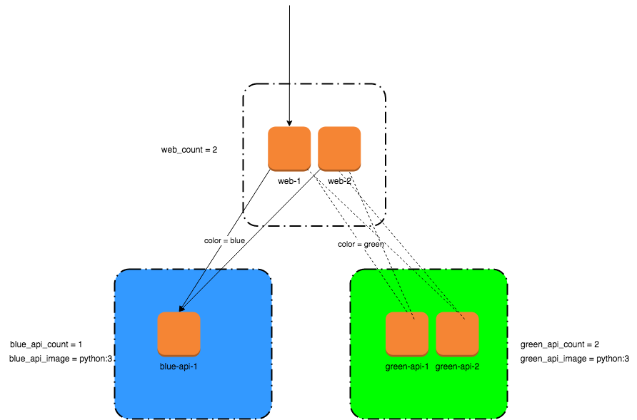

# terraform-infra-blue-green


Some examples on how to implement blue green with different stack and provider (docker, openstack)

* app-docker: sample app with docker container, with one web nginx as reverseproxy/lb and blue/green api container in backend
* app-openstack: sample app with openstack and heat stack, with one web nginx stack as reverseproxy/lb and blue/green api stack in backend

## Content of this repo

* terraform dir:
  + [terraform-examples/app-docker](terraform-examples/app-docker): web nginx as lb and blue green api (with container)
  + [terraform-examples/app-openstack](terraform-examples/app-openstack): web nginx as lb and blue green api (with openstack instance and heat stack)

* Makefile: to launch terraform cli with options and vars

* terraform cli in docker image: everything we need in one place, no matter who s running it or where. Useful for CI/CD
  + Dockerfile
    + install default deb packages (python, jq, openstack-client)
    + install pip modules
    + install terraform cli in /usr/local/bin
    + install versioned terraform plugins from providers.tf in /usr/local/share/terraform/plugins


## app-docker example

This example is described in [terraform-examples/app-docker](terraform-examples/app-docker) and will deploy the following components
* web: nginx container working as reverse proxy and lb (upstream backend to color blue or green api)
* blue-api, green-api: python container, listen on http 9000 port and reply, "hello "color", from container 'hostname'"



You can deploy and choose:
* the blue or green color api. The web nginx reverseproxy will be connected to the one you choose
* deploy 1 or N container in the blue or green stack (blue-api-1, blue-api-2...)
* choose the blue or green image (ex: blue = python:2, green = python:3, or blue = myapp:v1, green = myapp:v2 etc)
* you will find a terraform module examples [terraform-examples/app-docker/modules/api](terraform-examples/app-docker/modules/api) which create lightweight abstractions of docker resources with parameters (color, count, image, param) to deploy the api stack


In this example, to demonstrate the blue/green api and the switch between blue/green api on the reverseproxy/lb nginx, i use :

* api containers,  simple WSGI HTTP server, [terraform-examples/app-docker/python/api.py](terraform-examples/app-docker/python/api.py) listening on port 9000, and replying "Hello, ${color} from ${hostname}"

* a nginx web container with
  + 2 env variables (COLOR and API_SERVER)
  + dynamically replaced in a templated nginx configuration files [terraform-examples/app-docker/nginx/api.conf.template](terraform-examples/app-docker/nginx/api.conf.template)
```
upstream api-${COLOR} {
    # generate a list of server:
    # server name1:port; server name2:port;
    ${API_SERVER}
}

server {
    listen 80;
    location / {
            proxy_pass http://api-${COLOR};
    }
}

```
### Inputs

| Name | Description | Type | Default | Required |
|------|-------------|:----:|:-----:|:-----:|
| color | color stack to deploy (`blue` or `green`) | string | `blue` | no |
| web_port | Web external port | number | 80 | no |
| api_port | API internal port | number | 9000 | no |
| web_count | Web container count | number | 1 | no |
| blue_api_count | Blue API container count  | number | 1 | no |
| green_api_count | Green API container count | number | 1 | no |
| blue_api_image | Blue API docker image name | string | `python:3` | no |
| green_api_image | Green API docker image name | string | `python:3` | no |

### Outputs

| Name | Description |
|------|-------------|
| color | deployed stack (blue | green) |
| web_ip | web ip list |
| wep_port |  web port list |
| blue_api_name | Blue API containers name list |
| green_api_name | Green API containers name list |
| blue_api_ip | Blue API containers ip list |
| green_api_ip | Green API containers ip list |

### Test it
 Optionnal prerequisite: download and install terraform cli in ./bin if not already installed
```
# make install-tf
```
* First init
```
# make TF_BIN=bin/terraform PROJECT=terraform-examples/app-docker init
```
* Deploy default blue (1 blue-api)
```
# make TF_BIN=bin/terraform PROJECT=terraform-examples/app-docker deploy
# curl localhost
Hello, blue from e648210be937
```
* Deploy and switch to green (1 green-api)
```
# export TF_VAR_color=green ;
# make TF_BIN=bin/terraform PROJECT=terraform-examples/app-docker deploy
# curl localhost
Hello, green from fd2baa4f4758
```
* Deploy and switch to blue 
```
# unset TF_VAR_color ;
# make TF_BIN=bin/terraform PROJECT=terraform-examples/app-docker deploy
# curl localhost
Hello, blue from e648210be937
```
* Deploy 2 blue container
```
# export TF_VAR_blue_api_count=2
# make TF_BIN=bin/terraform PROJECT=terraform-examples/app-docker deploy
# curl localhost
Hello, blue from e648210be937
# curl localhost
Hello, blue from afd2315a1eec
```


## app-openstack example

This example is described in [terraform-examples/app-openstack](terraform-examples/app-openstack) and will deploy the following components
* web: nginx instance in a heat stack working as reverse proxy and lb (upstream backend to color blue or green api)
* blue-api, green-api: python instance in a heat stack , listen on http 9000 port and reply, "hello "color", from 'hostname'"


* This example demonstrate how to orchestrate openstack resources (network/subnet/fip/volume) and heat stack resources
* Heat Stack and wait condition in instance: allow to launch instances in an ordered way and initiate a signal to heat when somethind append (end of installation, for example)
* A sample config/envirnement file is provided as a model to register your own parameters (flavor, dns,...). Your file must be added to the make command

## Usage:

### use terraform cli
* install-tf: install cli/terraform in bin/ dir 
```
  # install latest terraform cli
  make install-tf
  # or install specific terraform cli version
  make install-tf TF_BIN_VERSION=0.14.5
```

* format: check and format tf files
```
  make PROJECT=terraform-examples/app-docker TF_BIN=bin/terraform format
```
* init: init state (providers,modules,backend)
```
  make PROJECT=terraform-examples/app-docker init
```
* deploy: deploy app-project . It play (validate, plan, apply)
```
  make PROJECT=terraform-examples/app-docker  deploy
```
* deploy with alternative terraform binary
```
  make PROJECT=terraform-examples/app-docker TF_BIN=./terraform_0.14.5 deploy
```
* deploy with alternative configuration var file
```
  make PROJECT=terraform-examples/app-docker TF_BIN=bin/terraform TF_VAR_FILE="-var-file=$(pwd)/config.auto.tfvars" deploy
```
* destroy: destroy app-project
```
  make PROJECT=terraform-examples/app-docker destroy
```
### use terraform cli in docker
* build: build docker cli/terraform image with downloaded providers. This image can be use offline with docker-compose (use make target tf-XX)
```
  make build
``` 
* plan (with terraform docker cli)
```
time make PROJECT="terraform-examples/app-docker" DC_TF_ENV=" -f docker-compose.app-docker.yml" tf-plan

time make PROJECT="terraform-examples/app-openstack" tf-plan
```
* With terraform docker cli, you can pass the config.vars in the container with TF_VAR_FILE and override docker-compose file to mount this file in the container
```
  # cat config.auto.tfvars
  dns_ip=["10.1.1.1", "10.2.2.2"]
  external_network="ext-net"
  color="green"
  # end file
  make PROJECT="terraform-examples/app-openstack" TF_VAR_FILE="-var-file=/terraform/config.auto.tfvars" DC_TF_ENV=" -f docker-compose.app-openstack.yml" tf-deploy
```

* or With terraform docker cli, you can convert the tf config.vars in a TF_VAR_variable file, named as "app-openstack.env". This file is automatically loaded with docker-compose if present
```
  # cat app-openstack.env (no quote around values)
  TF_VAR_dns_ip=["10.228.245.129","10.228.245.130"]
  TF_VAR_external_network=ext-net-z1
  TF_VAR_color=green

  make PROJECT="terraform-examples/app-openstack" DC_TF_ENV=" -f docker-compose.app-openstack.yml" tf-deploy
```


## TODO:
* environment files
* use docker cli
* add wrapper to detect current color from previous output and change (if blue, then green)
* terragrunt wrapper
